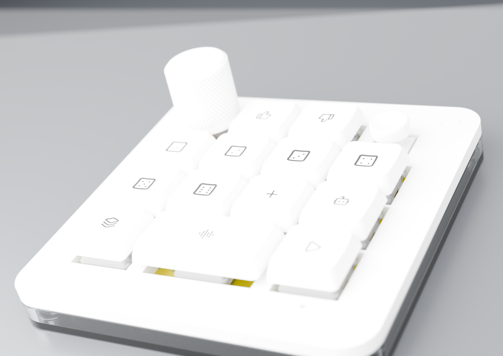
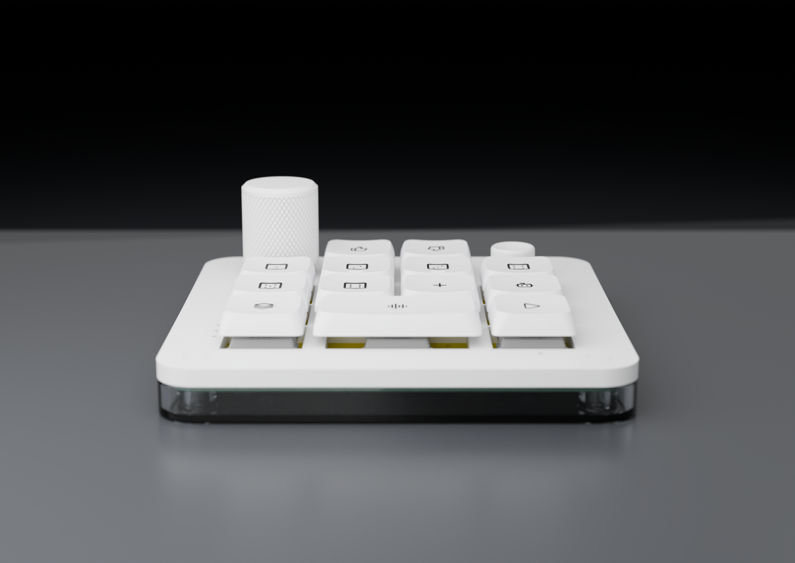
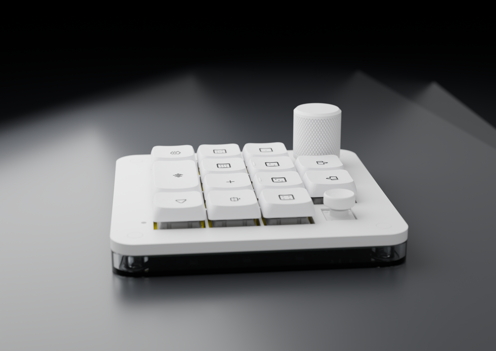
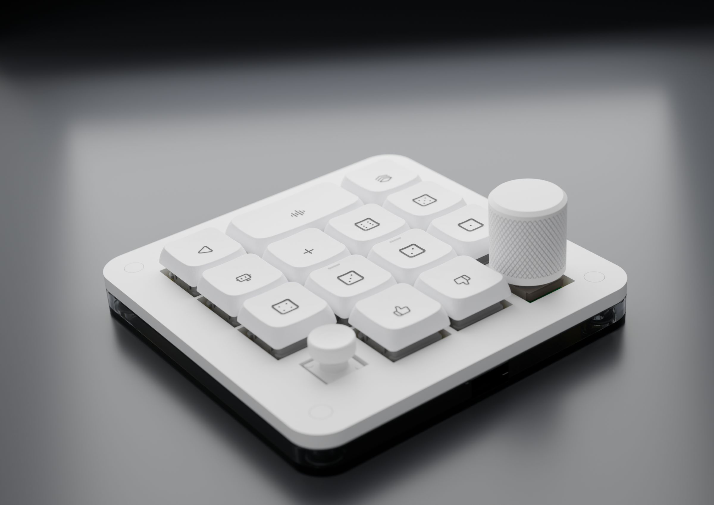
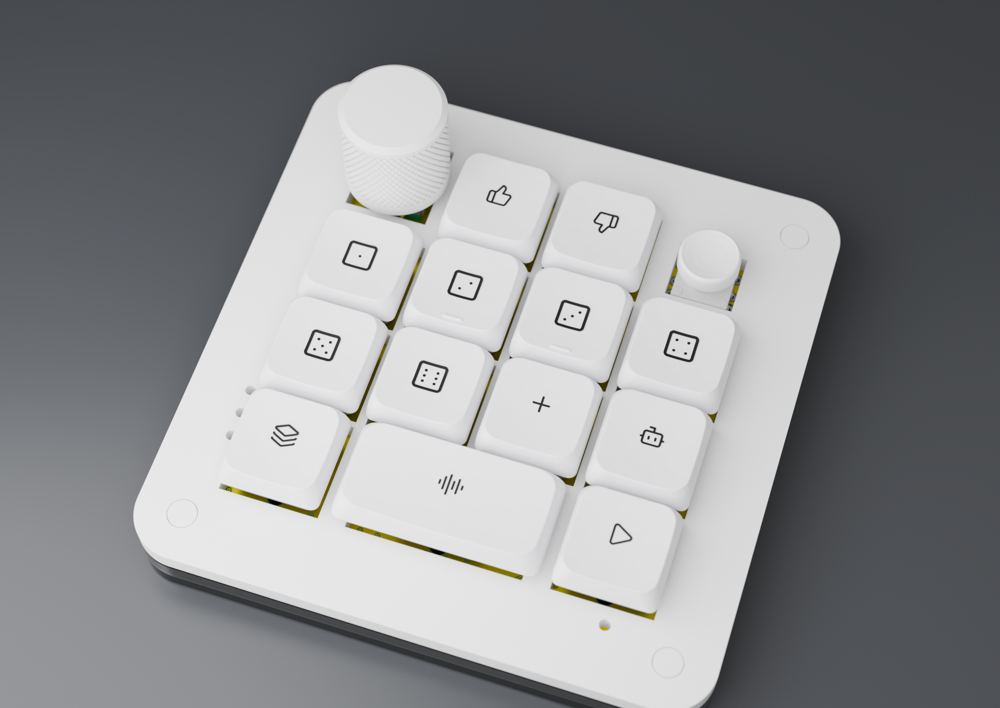

# AgentDeck

**AgentDeck is an open-source desk macropad for supervising AI coding agents.**

_AgentDeck is optimized for people running several coding agents at once who
want glanceable status and one-hand control. It is a desk device, not a
portable one: USB-C only, no battery, no radio._

- [Design notes](v1/DESIGN.md)
- [Changelog](CHANGELOG.md)
- [Licensing](LICENSING.md)

Six agent keys light up with each agent's live state (idle, thinking, working,
blocked, done). Press one to focus that session. The command keys accept or
reject work, the dial scrubs and confirms, and the joystick navigates. A host
bridge maps Claude Code hooks to the key colours, so the board answers "which
of my sessions needs me?" without alt-tabbing.

> **This is a Codex Micro-inspired project.** The concept follows OpenAI and
> Work Louder's Codex Micro, and the control layout deliberately echoes it. It
> is an independent build, not affiliated with, endorsed by, or produced with
> OpenAI, Work Louder, or Anthropic. The board, firmware and enclosure are
> original work; no Codex Micro files were used. Some material in this
> repository (vendor footprints, datasheets, reference photographs, third-party
> cap and knob models) is not ours to license. See [LICENSING.md](LICENSING.md).

## Renders

| | |
|---|---|
|  |  |
|  |  |

## Changelog

Hardware revisions are tracked in the [changelog](CHANGELOG.md). Because the
board is text-based KiCad, every fabricated revision maps to a tagged commit,
and a physical board can be traced back to the exact design it was made from.

## Versions

| Version | What it is | Where |
|---|---|---|
| **V1** (this release) | 95 x 95 mm 4-layer RP2040 board, 13 keys, JLCPCB PCBA | `v1/hardware/` |

What comes next (v1.0 bring-up, the v1.1 depth release, and what is
deliberately parked) is in the [roadmap](docs/ROADMAP.md).

## Status

| Part | State |
|---|---|
| Schematic + PCB | Complete. 4 layers, fully routed, 0 DRC errors, 0 ERC errors |
| Firmware | Written (CircuitPython, plus an Arduino/C++ port), untested on hardware |
| Host bridge | Written. Maps Claude Code hooks to agent-key colours |
| Enclosure | Modelled and fit-checked in Blender, STLs exported, not yet printed |
| Fab package | Gerbers, BOM and CPL generated for JLCPCB |

Nothing has been manufactured yet, so none of it is hardware-verified.

## Packages

The repository is organized by discipline. Each directory is self-contained
and has its own README where the workflow needs explaining.

| Directory | Contents |
|---|---|
| `v1/hardware/` | KiCad 10 project: `AgentDeck.kicad_pcb`, `AgentDeck.kicad_sch`, footprint / symbol / 3D libraries |
| `v1/enclosure/` | Blender assembly (`AgentDeck-v2-assembled.blend`), the parametric case generator (`src/generate_case.py`), printable STLs, keycap icon art |
| `v1/firmware/` | CircuitPython firmware (`boot.py`, `code.py`) and the Arduino port |
| `v1/host/` | `agentdeck_bridge.py`, the Claude Code hook bridge |
| `v1/fab/` | Gerbers, drill files, BOM and CPL for JLCPCB |
| `docs/` | design notes, datasheets, reference material, renders in `docs/img/` |
| `LICENSES/` | full licence texts |

## Hardware

The board is a 95 x 95 mm 4-layer PCB, drawn in KiCad 10.

- 13 Kailh Choc hot-swap keys on an 18.7 x 19.3 mm grid, each with a
  reverse-mount SK6812MINI-E RGB LED shining up through the cap
- EC11 rotary encoder (top left) and Alps SKQUCAA010 5-way joystick (top right)
- RP2040 with W25Q128 16 MB flash, USB-C, BOOT button, SWD pads
- Everything is wired directly to GPIO. There is no key matrix, so there is
  no ghosting to debounce around
- All SMD parts sit on the back of the board and hang down into the case
  tray; only the switches, encoder and joystick face up

Keycaps carry simple engraved-style icons (dice for the six agent keys,
thumbs up and down for accept and reject) rendered from
[Lucide](https://lucide.dev) glyphs. The encoder and joystick caps are white.

## Enclosure

Two printed parts plus four printed cover caps. The PCB drops into the bottom
tray component-side down, the lid closes over it, and four screws clamp the
stack into brass inserts.

| Feature | Spec |
|---|---|
| Screws | M2.5 x 8 mm button head (ISO 7380), head 4.7 x 1.3 mm |
| Lid | 5.2 mm counterbore, 2.5 mm deep, over a 2.9 mm shaft hole |
| Inserts | M2.5 brass heat-set, 4.0 mm OD x 5.0 mm, melted into a 3.6 mm boss bore |
| Cover caps | printed 5.0 x 1.2 mm plugs that hide the screw heads |
| Fit | 0.4 mm pocket clearance around the board (a deliberately loose fit) |
| USB | side port through the tray wall, sized for the plug plus a slim overmould |
| Walls | 2.6 mm, with a 0.6 mm bevel on exposed edges |

Print `v1/enclosure/case-bottom.stl`, `v1/enclosure/case-top-lid.stl`, and four of
`v1/enclosure/case-cover-plug.stl`. The case is generated, not sculpted: edit the
parameters in `v1/enclosure/src/generate_case.py` and re-run it to get new STLs.

## Firmware

Copy `v1/firmware/boot.py` and `code.py` onto a CIRCUITPY drive running
CircuitPython 9.x, with `adafruit_hid` and `neopixel` in `lib/`. An Arduino
port with identical behaviour lives in `v1/firmware/arduino/` if you prefer a
compiled build.

The command keys send Ctrl+Alt chords, the dial sets reasoning effort, and the
joystick navigates. `v1/firmware/README.md` has the full control table, colour
legend, pin map, and the three constants to confirm on first hardware.

## Development

- **Board edits**: open `v1/hardware/AgentDeck.kicad_pcb` in KiCad 10. After
  copper changes, refill zones before running DRC, then regenerate `v1/fab/`
  with `kicad-cli`.
- **Case edits**: run `v1/enclosure/src/generate_case.py` in Blender to rebuild
  the STLs from parameters.
- **Renders**: the assembly lives in `v1/enclosure/AgentDeck-v2-assembled.blend`;
  reference renders are committed under `docs/img/`.
- Derived files (board 3D exports, `.dsn`/`.ses` routing intermediates,
  autorouter logs) are gitignored and regenerate from the board.

## Licence

Multi-licensed, as is normal for open hardware. See [LICENSING.md](LICENSING.md).

| What | Licence |
|---|---|
| Software (`v1/firmware/`, `v1/host/`) | [MIT](LICENSES/MIT.txt) |
| Hardware (board, enclosure, fab files) | [CERN-OHL-S v2](LICENSES/CERN-OHL-S-v2.txt) |
| Documentation | [CC-BY-4.0](LICENSES/CC-BY-4.0.txt) |

Vendor footprints, datasheets and reference images keep their original terms.
Keycap icons are from [Lucide](https://lucide.dev) (ISC).
